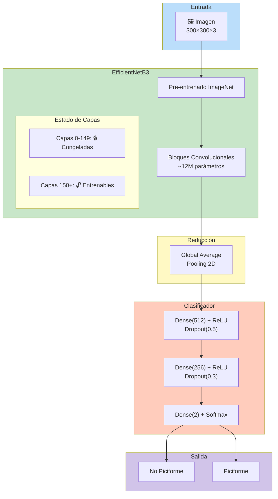
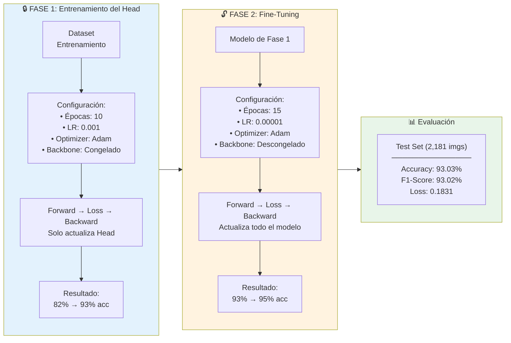

# Entrenamiento del Modelo Identificador: Clasificación Binaria de Aves Piciformes

## 1. Introducción

El presente documento describe el proceso de entrenamiento del modelo de clasificación binaria diseñado para distinguir entre imágenes de aves pertenecientes al orden Piciformes y aquellas que no pertenecen a dicho orden taxonómico.

Este modelo constituye la primera etapa del sistema de clasificación en cascada implementado en la aplicación BirdID-Piciformes. Su función es actuar como filtro inicial, determinando si una imagen de entrada contiene un ave Piciforme antes de proceder a la clasificación de especie.

---

## 1.1 Diagrama de Flujo del Entrenamiento

> **Nota:** Para exportar como imagen, copiar el código Mermaid a [mermaid.live](https://mermaid.live) y descargar como PNG/SVG.

```mermaid
flowchart TB
    subgraph DATA["📊 1. DATOS DE ENTRADA"]
        direction LR
        P["🐦 Piciformes<br/>~7,270 imgs<br/><i>Ramphastidae, Picidae</i>"]
        NP["🚫 No Piciformes<br/>~7,270 imgs<br/><i>Otros órdenes</i>"]
        P --> TOTAL["📁 Total: 14,540 imágenes<br/>Clases balanceadas"]
        NP --> TOTAL
    end

    subgraph SPLIT["📂 2. PARTICIÓN DEL DATASET"]
        direction LR
        TOTAL --> TRAIN["🎓 Entrenamiento<br/>70% (10,178 imgs)<br/><i>Optimización</i>"]
        TOTAL --> VAL["📝 Validación<br/>15% (2,181 imgs)<br/><i>Monitoreo</i>"]
        TOTAL --> TEST["🏆 Prueba<br/>15% (2,181 imgs)<br/><i>Evaluación final</i>"]
    end

    subgraph AUG["🔄 3. DATA AUGMENTATION"]
        direction LR
        TRAIN --> ROT["Rotación ±20°"]
        TRAIN --> SHIFT["Desplazamiento 20%"]
        TRAIN --> FLIP["Flip Horizontal"]
        ROT --> AUGOUT["ImageDataGenerator"]
        SHIFT --> AUGOUT
        FLIP --> AUGOUT
    end

    subgraph PREPROCESS["⚙️ 4. PREPROCESAMIENTO"]
        AUGOUT --> RESIZE["Resize: 300×300×3 RGB"]
        RESIZE --> NORM["EfficientNet preprocess_input"]
    end

    subgraph MODEL["🧠 5. ARQUITECTURA DEL MODELO"]
        direction TB
        NORM --> INPUT["📥 Input Layer<br/>(300, 300, 3)"]
        INPUT --> BACKBONE
        
        subgraph BACKBONE["EfficientNetB3 - ImageNet"]
            direction TB
            FROZEN["🔒 Capas 0-149<br/>CONGELADAS"]
            UNFROZEN["🔓 Capas 150+<br/>AJUSTABLES"]
        end
        
        BACKBONE --> GAP["Global Average Pooling 2D"]
        GAP --> HEAD
        
        subgraph HEAD["Clasificador (Head)"]
            direction TB
            D1["Dense(512) + ReLU<br/>Dropout(0.5)"]
            D2["Dense(256) + ReLU<br/>Dropout(0.3)"]
            OUT["Dense(2) + Softmax"]
            D1 --> D2 --> OUT
        end
    end

    subgraph TRAINING["🏋️ 6. ENTRENAMIENTO"]
        direction TB
        HEAD --> PHASE1
        
        subgraph PHASE1["FASE 1: Head Only"]
            P1_CONFIG["Épocas: 10<br/>LR: 1×10⁻³<br/>Backbone: 🔒 Congelado"]
            P1_RESULT["82% → 93% accuracy"]
        end
        
        PHASE1 --> PHASE2
        
        subgraph PHASE2["FASE 2: Fine-Tuning"]
            P2_CONFIG["Épocas: 15<br/>LR: 1×10⁻⁵<br/>Backbone: 🔓 Descongelado"]
            P2_RESULT["93% → 95% accuracy"]
        end
    end

    subgraph EVAL["📈 7. EVALUACIÓN FINAL"]
        direction TB
        PHASE2 --> METRICS["Accuracy: 93.03%<br/>F1-Score: 93.02%<br/>Loss: 0.1831"]
        TEST --> METRICS
        METRICS --> CM["Matriz de Confusión<br/>TN: 1,065 | FP: 48<br/>FN: 104 | TP: 964"]
    end

    subgraph SAVE["💾 8. PERSISTENCIA"]
        direction LR
        CM --> KERAS[".keras<br/><i>Keras 3.x</i>"]
        CM --> H5[".h5<br/><i>Legacy</i>"]
        KERAS --> HF["🤗 Hugging Face Hub"]
        H5 --> HF
    end

    subgraph INFRA["🖥️ 9. INFRAESTRUCTURA"]
        HF --> GPU["NVIDIA A100-80GB<br/>CUDA 12.4<br/>TensorFlow 2.x<br/>~2 horas"]
    end

    style DATA fill:#e1f5fe
    style SPLIT fill:#fff3e0
    style AUG fill:#f3e5f5
    style PREPROCESS fill:#e8f5e9
    style MODEL fill:#fce4ec
    style TRAINING fill:#fff8e1
    style EVAL fill:#e0f2f1
    style SAVE fill:#f1f8e9
    style INFRA fill:#eceff1
```

### Diagrama de Arquitectura de la Red

### Diagrama del Proceso de Entrenamiento en Dos Fases

---

## 2. Conjunto de Datos

### 2.1 Descripción del Dataset

El conjunto de datos utilizado comprende **14,540 imágenes** distribuidas en dos clases balanceadas:

| Clase | Descripción | Cantidad aproximada |
|-------|-------------|---------------------|
| Piciformes | Imágenes de aves del orden Piciformes (Ramphastidae, Picidae) | 7,270 |
| No Piciformes | Imágenes de aves de otros órdenes taxonómicos | 7,270 |

### 2.2 Partición del Dataset

Se aplicó una estrategia de partición estratificada con semilla fija (seed=42) para garantizar reproducibilidad:

| Partición | Proporción | Cantidad | Propósito |
|-----------|------------|----------|-----------|
| Entrenamiento | 70% | 10,178 | Optimización de parámetros del modelo |
| Validación | 15% | 2,181 | Monitoreo del sobreajuste durante entrenamiento |
| Prueba | 15% | 2,181 | Evaluación final del rendimiento |

---

## 3. Arquitectura del Modelo

### 3.1 Enfoque de Transfer Learning

Se empleó la técnica de Transfer Learning utilizando como backbone el modelo **EfficientNetB3** pre-entrenado en el dataset ImageNet (1.2 millones de imágenes, 1000 clases). Esta estrategia permite aprovechar las representaciones de características aprendidas previamente, reduciendo significativamente el tiempo de entrenamiento y mejorando la capacidad de generalización.

### 3.2 Estructura de la Red

La arquitectura implementada consta de los siguientes componentes:

**Entrada:**
- Dimensiones: 300 × 300 × 3 (RGB)
- Preprocesamiento: `tf.keras.applications.efficientnet.preprocess_input`

**Backbone (EfficientNetB3):**
- Capas convolucionales pre-entrenadas
- Primeras 150 capas congeladas durante fine-tuning
- Salida: tensor de características de alta dimensionalidad

**Clasificador (Head):**

| Capa | Configuración | Función de activación |
|------|---------------|----------------------|
| Global Average Pooling 2D | Reducción espacial | - |
| Dense | 512 unidades | ReLU |
| Dropout | rate = 0.5 | - |
| Dense | 256 unidades | ReLU |
| Dropout | rate = 0.3 | - |
| Dense (salida) | 2 unidades | Softmax |

### 3.3 Regularización

Se aplicaron las siguientes técnicas de regularización para prevenir sobreajuste:

- **Dropout**: Desactivación aleatoria de neuronas (50% en primera capa densa, 30% en segunda)
- **Data Augmentation**: Transformaciones geométricas en tiempo de entrenamiento
- **Early fine-tuning layers frozen**: Preservación de características de bajo nivel

---

## 4. Proceso de Entrenamiento

### 4.1 Estrategia de Dos Fases

El entrenamiento se realizó en dos fases secuenciales para optimizar la convergencia:

#### Fase 1: Entrenamiento del Clasificador

| Parámetro | Valor |
|-----------|-------|
| Épocas | 10 |
| Learning rate | 1 × 10⁻³ |
| Optimizador | Adam |
| Backbone | Congelado |

**Objetivo:** Entrenar exclusivamente las capas del clasificador mientras el backbone permanece fijo, permitiendo una adaptación inicial al dominio específico.

#### Fase 2: Fine-Tuning

| Parámetro | Valor |
|-----------|-------|
| Épocas adicionales | 15 |
| Learning rate | 1 × 10⁻⁵ |
| Optimizador | Adam |
| Capas descongeladas | Desde capa 150 en adelante |

**Objetivo:** Ajuste fino de las capas superiores del backbone para especializar las representaciones de características en el dominio de aves Piciformes.

### 4.2 Data Augmentation

Durante el entrenamiento se aplicaron las siguientes transformaciones en tiempo real:

| Transformación | Parámetro |
|----------------|-----------|
| Rotación | ±20° |
| Desplazamiento horizontal | 20% |
| Desplazamiento vertical | 20% |
| Reflexión horizontal | Aleatoria |

### 4.3 Función de Pérdida y Métricas

- **Función de pérdida:** Categorical Cross-Entropy
- **Métricas de monitoreo:** Accuracy, F1-Score (weighted average)
- **Precisión numérica:** Mixed precision (float16) para optimización de memoria GPU

---

## 5. Resultados

### 5.1 Métricas de Evaluación en Conjunto de Prueba

La evaluación final se realizó sobre las 2,181 imágenes del conjunto de prueba, no utilizadas durante el entrenamiento ni la validación:

| Métrica | Valor |
|---------|-------|
| Accuracy | 93.03% |
| F1-Score (weighted) | 93.02% |
| Loss | 0.1831 |

### 5.2 Rendimiento por Clase

| Clase | Precision | Recall | F1-Score | Support |
|-------|-----------|--------|----------|---------|
| No Piciformes | 0.91 | 0.96 | 0.93 | 1,113 |
| Piciformes | 0.95 | 0.90 | 0.93 | 1,068 |
| **Promedio ponderado** | **0.93** | **0.93** | **0.93** | **2,181** |

### 5.3 Matriz de Confusión

|  | Predicción: No Piciforme | Predicción: Piciforme |
|--|--------------------------|----------------------|
| **Real: No Piciforme** | 1,065 (TN) | 48 (FP) |
| **Real: Piciforme** | 104 (FN) | 964 (TP) |

**Análisis:**
- **Verdaderos Negativos (TN):** 1,065 imágenes de No Piciformes clasificadas correctamente
- **Verdaderos Positivos (TP):** 964 imágenes de Piciformes clasificadas correctamente
- **Falsos Positivos (FP):** 48 imágenes de No Piciformes clasificadas erróneamente como Piciformes
- **Falsos Negativos (FN):** 104 imágenes de Piciformes clasificadas erróneamente como No Piciformes

La tasa de error total es del 6.97% (152/2,181 clasificaciones incorrectas).

---

## 6. Infraestructura Computacional

El entrenamiento se ejecutó en la plataforma Google Colaboratory con los siguientes recursos:

| Componente | Especificación |
|------------|----------------|
| GPU | NVIDIA A100-SXM4-80GB |
| CUDA | Versión 12.4 |
| Driver | 550.54.15 |
| Framework | TensorFlow 2.x |
| Precisión | Mixed precision (float16) |

**Tiempo total de entrenamiento:** Aproximadamente 2 horas (25 épocas)

---

## 7. Persistencia del Modelo

El modelo entrenado se almacenó en los siguientes formatos:

| Formato | Archivo | Observaciones |
|---------|---------|---------------|
| Keras nativo (.keras) | `clasificador_aves_piciformes_efficientnetv2.keras` | Formato recomendado para Keras 3.x |
| HDF5 (.h5) | `clasificador_aves_piciformes_efficientnetv2.h5` | Compatibilidad con versiones anteriores |

---

## 8. Integración con el Sistema

Este modelo se integra como primera etapa del pipeline de clasificación de la aplicación BirdID-Piciformes:

1. La imagen de entrada se redimensiona a 300×300 píxeles
2. Se aplica el preprocesamiento específico de EfficientNet
3. El modelo genera probabilidades para ambas clases
4. Si P(Piciforme) ≥ 0.5, la imagen procede al clasificador de especies
5. En caso contrario, se finaliza el proceso indicando que la imagen no corresponde a un Piciforme

---

## 9. Conclusiones

El modelo de clasificación binaria alcanzó un rendimiento satisfactorio con un 93% de accuracy y F1-Score en el conjunto de prueba. La estrategia de Transfer Learning con EfficientNetB3 demostró ser efectiva para el dominio de clasificación de aves, logrando una convergencia estable en 25 épocas de entrenamiento.

El balance entre Precision y Recall para ambas clases indica que el modelo no presenta sesgo significativo hacia ninguna de las categorías, lo cual es deseable para su función como filtro inicial en el sistema de clasificación en cascada.

---

## Referencias

- Tan, M., & Le, Q. (2019). EfficientNet: Rethinking Model Scaling for Convolutional Neural Networks. *International Conference on Machine Learning (ICML)*.
- Russakovsky, O., et al. (2015). ImageNet Large Scale Visual Recognition Challenge. *International Journal of Computer Vision*, 115(3), 211-252.
- TensorFlow Documentation. (2024). Transfer learning and fine-tuning. https://www.tensorflow.org/tutorials/images/transfer_learning

---

**Documento técnico - Proyecto BirdID-Piciformes**  
*Maestría en Ingeniería de la Información (MINE) - 2025*
